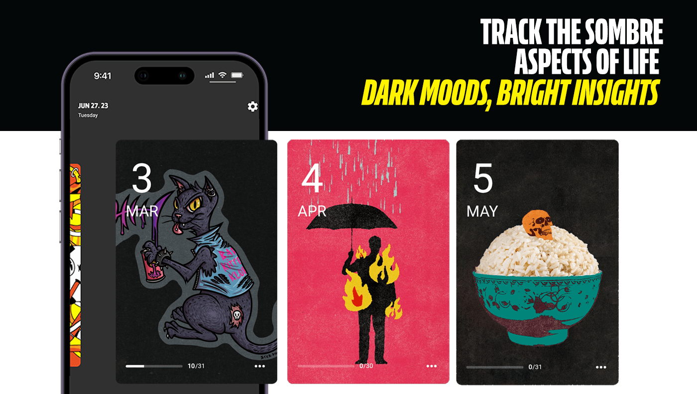
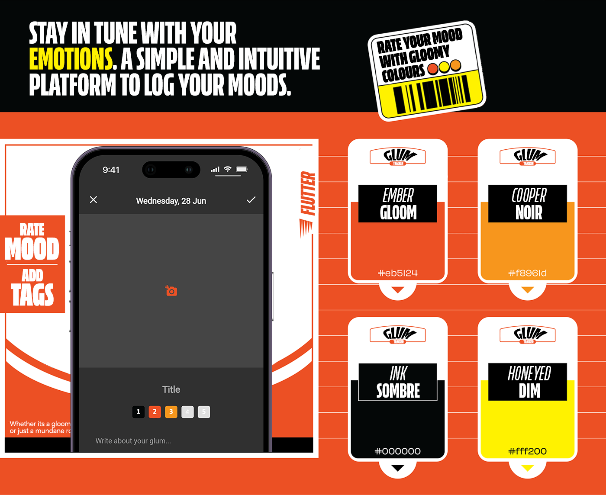
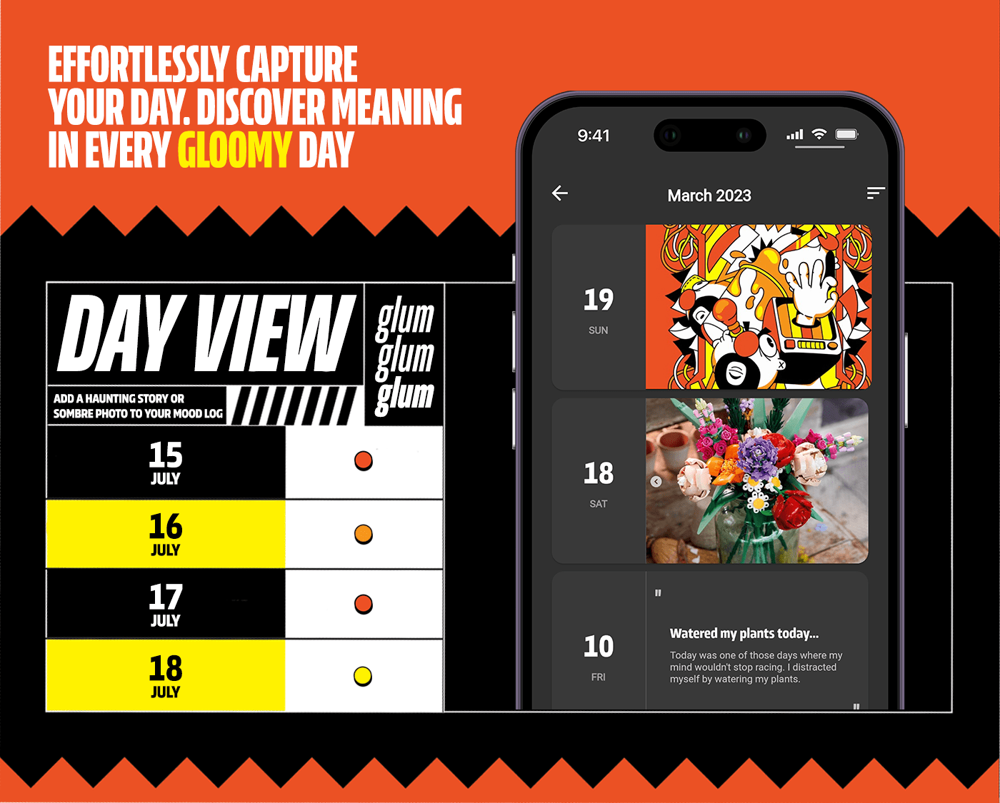
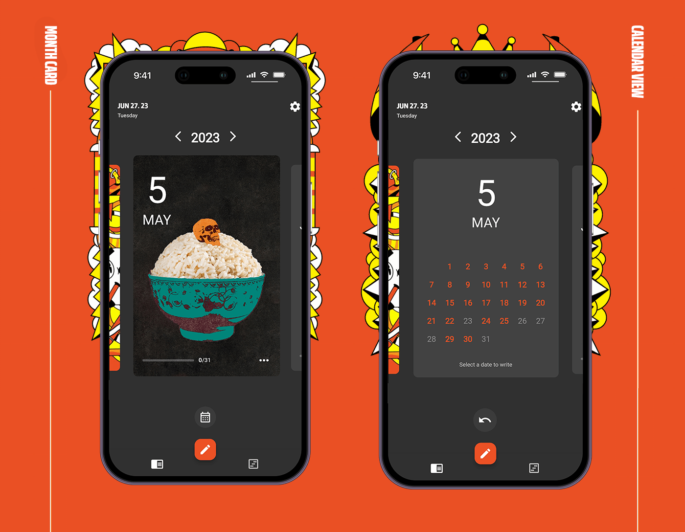
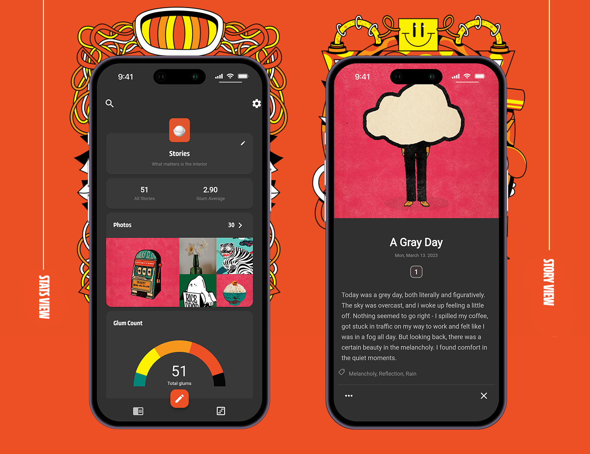

# 🌚 Glum - Mood Tracker

Glum is a mood tracking application, conceptualized and crafted in Flutter. Its unique and dark-themed design lets you express and monitor your emotions through a moody and gloom-tinged interface. Whether it's a simple line of text or an image that defines your mood, Glum encourages you to embrace the somber and tranquil moments of your day.

## Table of Contents

- [🌟 Features](#-features)
- [🏗️ Architecture](#-architecture)
- [🔧 Technical Stack](#-technical-stack)
- [🚀 Getting Started](#-getting-started)
- [🧪  Unit Testing](#-unit-testing)
- [🤝 Contributing](#-contributing)
- [📝 License](#-license)

## 🌟 Features

In the somber world of Glum, we provide a collection of features, designed to illuminate your path to self-awareness:

- **Card-Based Mood Entries:** Transform your emotions into a unique card, either using text or a picture to encapsulate your feelings.
- **Multiple Entries per Day:** Mood fluctuations are a part of life; Glum allows you to record multiple mood entries per day.
- **Customizable Card Design:** Add a personal touch to each mood card using photos or from a selection of dark-hued colors.
- **Calendar View:** A beautifully gloomy calendar view of your mood entries.
- **Rich Media Support:** Accompany your mood entries with photos and videos for a deeper emotional context.
- **Emotion and Weather Tags:** Add an extra layer of depth to your entries with emotion and weather tags, capturing the environment of your sentiments.
- **Location and Custom Tags:** Track the impact of your location on your mood and create custom tags for easy categorization and recall.
- **Favorites:** Highlight the mood entries that resonate with you the most.
- **Font Customization:** Personalize your entries with a variety of fonts and styles to match your mood and setting.
- **Timestamps and Dividers:** Organize your entries neatly with timestamps and dividers.
- **Dark Mode:** For your late-night reflections, Glum's dark theme provides the perfect setting.

## 🏗️ Architecture

Glum follows principles from Domain-Driven Design (DDD) and Clean Architecture, resulting in a layered architectural style:

- **Presentation Layer**: This layer houses all the user interface components and user interactions in Glum, with a dark-themed design for easy navigation.
- **Application Layer**: This layer works as the intermediary of Glum, taking user actions from the Presentation layer and directing them to the appropriate services in the Domain layer.
- **Domain Layer**: This is the heart of Glum, encapsulating all the business logic. It includes the models and business rules for moods and tags.
- **Infrastructure Layer**: This layer handles all data operations in Glum, managing data storage and retrieval through APIs and databases like SQLite.

## 🔧 Technical Stack

Glum casts its gloomy light using the following technology stack:

### Frontend:

- **Flutter:** A UI toolkit from Google for building natively compiled applications for mobile, web, and desktop from a single codebase.
- **Flutter Hooks:** A collection of utilities for managing state and other aspects of Flutter applications.
- **Riverpod:** A pragmatic state management library.
- **Auto Route:** An easy yet powerful routing solution, allowing for complex route patterns and transitions.

### Backend:
- **Freezed:** A code generator for unions/pattern-matching/copy in Dart.
-  **SQLite with Drift:** SQLite provides a robust, transactional SQL database engine. With the addition of the Drift package, Glum offers smooth and reactive persistence operations, turning SQLite into a high-level, easy-to-use Flutter database solution.
- **Dartz:** Functional programming library in Dart, introduces the Either type used for error handling, enhancing app stability and reliability.
- **Mockito:** Dart library for creating mock objects during testing, enables error simulation to verify the robustness of Glum's error handling mechanisms.
- **Other Libraries:** Image Cropper, Image Picker, JSON Annotation, JSON Serializable, and more.

## 🚀 Getting Started

1. Make sure you have [Flutter installed](https://flutter.dev/docs/get-started/install) on your local machine.
2. Clone the repository with `git clone https://github.com/freemantg/glum.git`.
3. Run `flutter packages get` in the root directory to fetch the project dependencies.
4. Execute `flutter run` to run the project on your device/emulator.

## 🧪 Unit Testing

This project places a high priority on software quality and maintainability. As a result, extensive unit testing to ensure the software's robustness and reliability, with tests covering all major components of the application is used.

The project employs the `flutter_test` package for unit and widget tests, `mockito` for creating mocks in tests, and `ProviderContainer` for thoroughly testing the StateNotifiers to ensure that the app state is managed correctly.

To run the tests, simply execute the following command in the project root:

`Flutter Test`

## Contributing 🤝

We welcome contributions from the community. If you wish to contribute, please take a look at our contributing guidelines.

## License 📄

Glum is licensed under the MIT License. See `LICENSE` for more information.

## Contact 📞

If you have any questions or suggestions, please reach out to us at <contact@freemantang.dev>. We'd love to hear from you!
